# Q-Learning ile Otomatik Izgara Navigasyonu (AGV)

Bu repo, Derin Pekiştirmeli Öğrenme dersi vize ödevim için hazırladığım çalışmadır. Konu başlığım **Otomatik Izgara Navigasyonu (AGV)**: 10×10'luk bir fabrika zemininde hareket eden robot, engellere çarpmadan başlangıç noktasından şarj istasyonuna ulaşmaya çalışıyor.

Problemi klasik (tablo tabanlı) **Q-Learning** ile çözdüm. Derin öğrenme kullanılmadı; ortam küçük ve tüm durumlar tablolar halinde tutulabildiği için ders kapsamında en uygun yöntem buydu.

---

## 1. Problemin MDP Olarak Tanımı

| Bileşen | Açıklama |
|--------|----------|
| **Durum (s)** | Robotun bulunduğu hücrenin (X, Y) koordinatı. Toplam 100 olası durum. |
| **Aksiyon (a)** | {Yukarı, Aşağı, Sağ, Sol} — 4 aksiyon. |
| **Geçiş (P)** | Deterministik: aksiyon yönündeki hücreye geçer. Izgaranın dışına çıkma denenirse robot yerinde kalır. |
| **Ödül (r)** | Hedef: **+100** (terminal), engel: **−50** (terminal), her boş adım: **−1**. |
| **γ (iskonto)** | 0.95 |

Adım başına −1 cezası ajanı **en kısa yolu** bulmaya zorluyor; yoksa boşa dolaşıp toplam ödülü düşürüyor.

### Harita

Engellerin yerini elle seçtim ki ortada labirent benzeri bir yapı olsun ve birden fazla geçerli yol bulunsun. Tamamen rastgele dağıttığımda bazen başlangıçtan hedefe ulaşılamayan haritalar çıkıyordu, bu yüzden manuel bir tasarım daha güvenli.

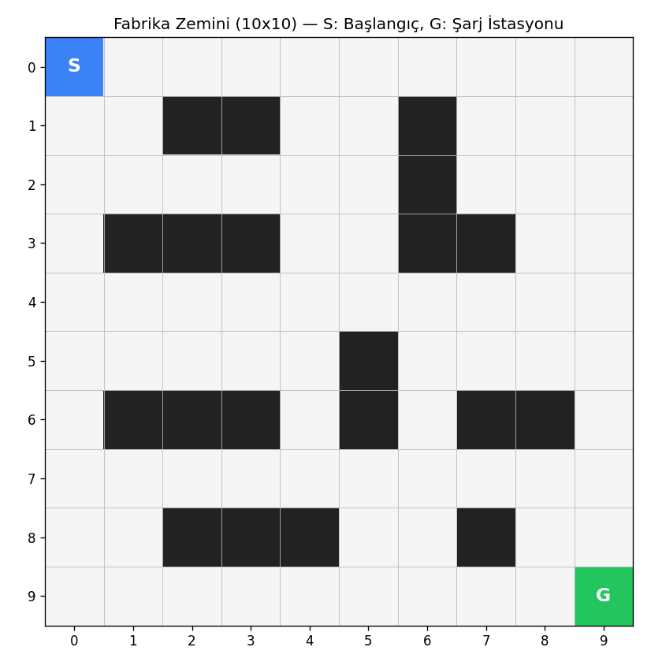

S: Başlangıç (0,0) — G: Hedef / Şarj İstasyonu (9,9) — Siyah hücreler: engeller.

---

## 2. Q-Learning Algoritması

Her (durum, aksiyon) ikilisi için bir tahmini değer Q(s, a) tutuluyor. Ortamla etkileşim oldukça bu tahminler **Bellman güncellemesi** ile düzeltiliyor:

```
Q(s, a) ← Q(s, a) + α · [ r + γ · max_{a'} Q(s', a') − Q(s, a) ]
```

- **α = 0.1** — öğrenme oranı. Yeni deneyime ne kadar ağırlık verdiğimizi belirliyor.
- **γ = 0.95** — gelecekteki ödülleri ne kadar değerli gördüğümüz.
- Aksiyon seçimi **ε-greedy**: ε olasılıkla rastgele aksiyon (keşif), kalan olasılıkla en yüksek Q değerli aksiyon (sömürü).
- ε başlangıçta 1.0, her episode sonunda 0.995 ile çarpılarak 0.05'e iniyor. Yani başta her şeyi deniyor, zamanla öğrendiğine güveniyor.

### Eğitim Hiperparametreleri

| Parametre | Değer |
|-----------|-------|
| Episode sayısı | 2000 |
| α (learning rate) | 0.1 |
| γ (discount) | 0.95 |
| ε başlangıç | 1.0 |
| ε min | 0.05 |
| ε decay | 0.995 |
| Max adım/episode | 200 |
| Rastgele tohumu | 42 |

---

## 3. Sonuçlar

### 3.1 Eğitim Sonrası Ajanın Davranışı

Aşağıdaki GIF, eğitilmiş ajanın **greedy** modda (ε = 0) başlangıçtan hedefe gidişini gösteriyor. **18 adımda** hedefe ulaşıyor ki bu Manhattan mesafesi olan |9−0| + |9−0| = 18 ile aynı — yani ajan bu engelli haritada ulaşılabilen en kısa yolu bulmuş.

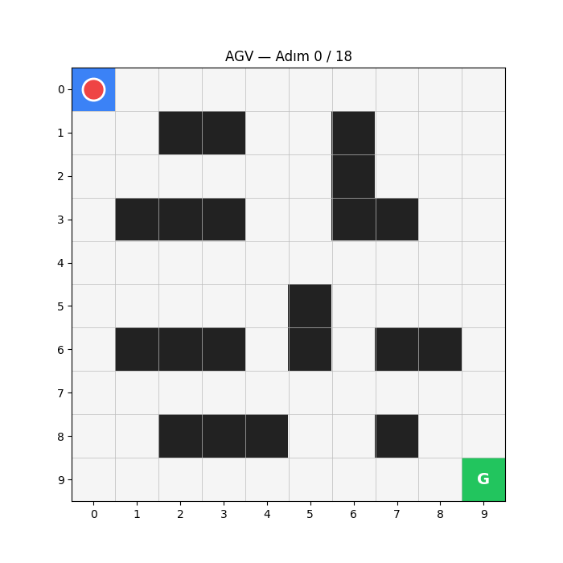

Tek bir episode için toplam ödül: **+83** (= 100 − 17 × 1, çünkü hedef adımı dahil 18 adım var).

### 3.2 Eğitim Eğrileri

**Episode başına toplam ödül:** Başlarda ajan rastgele dolaşıp engellere çarptığı için ödül −50 ile −100 arasında dolaşıyor. ~300. episode civarında öğrenme başlıyor, ~600. episode'dan sonra istikrarlı şekilde +60 ile +85 arasında ödül topluyor.

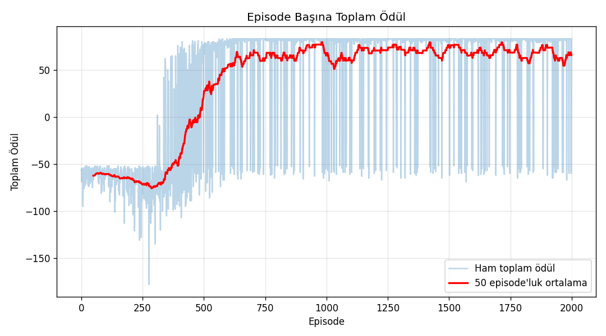

**Episode başına adım sayısı:** İlk yüzlerce episode'da çoğu zaman 200 adım sınırına dayanıyor (ajan kayboluyor). Eğitim ilerledikçe yol kısalıyor ve ortalama 18-25 adıma iniyor.

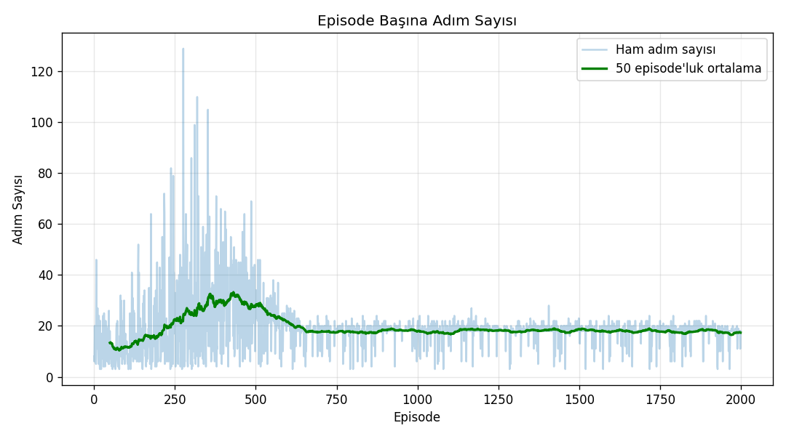

**Başarı oranı:** Hedefe ulaşılan episode'ların oranı (100'lük pencereyle hareketli ortalama). 1000. episode civarında %90'ı geçiyor.

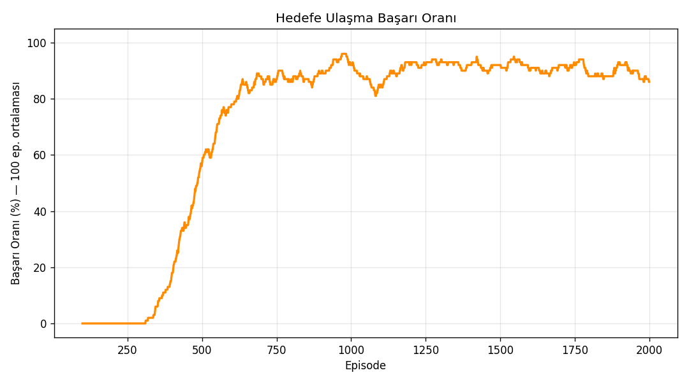

**Epsilon azalması:** Keşiften sömürüye geçişin görselleştirilmiş hali.

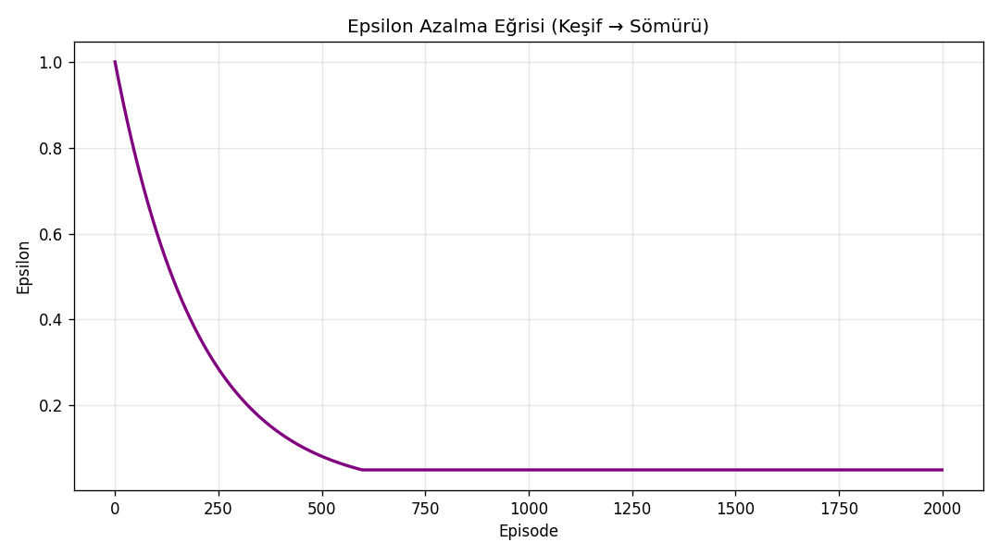

### 3.3 Öğrenilen Değer Fonksiyonu

V(s) = max_a Q(s, a) — yani her hücrede ajanın "buradayken kazanabileceğim en yüksek beklenen ödül" tahmini. Hedefe yaklaştıkça değerin sarıya doğru artması Bellman güncellemesinin doğru çalıştığını gösteriyor.

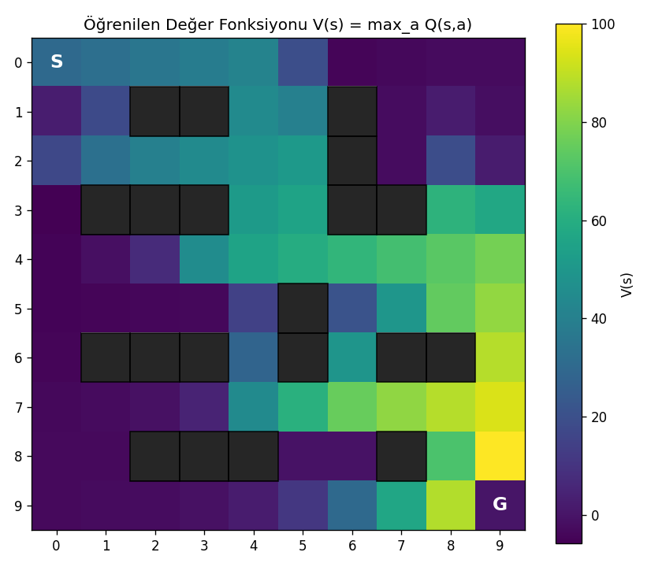

### 3.4 Öğrenilen Politika

Her hücrede ajanın seçeceği aksiyon. Engellerden kaçınıp hedefe doğru akan bir vektör alanı oluşmuş.

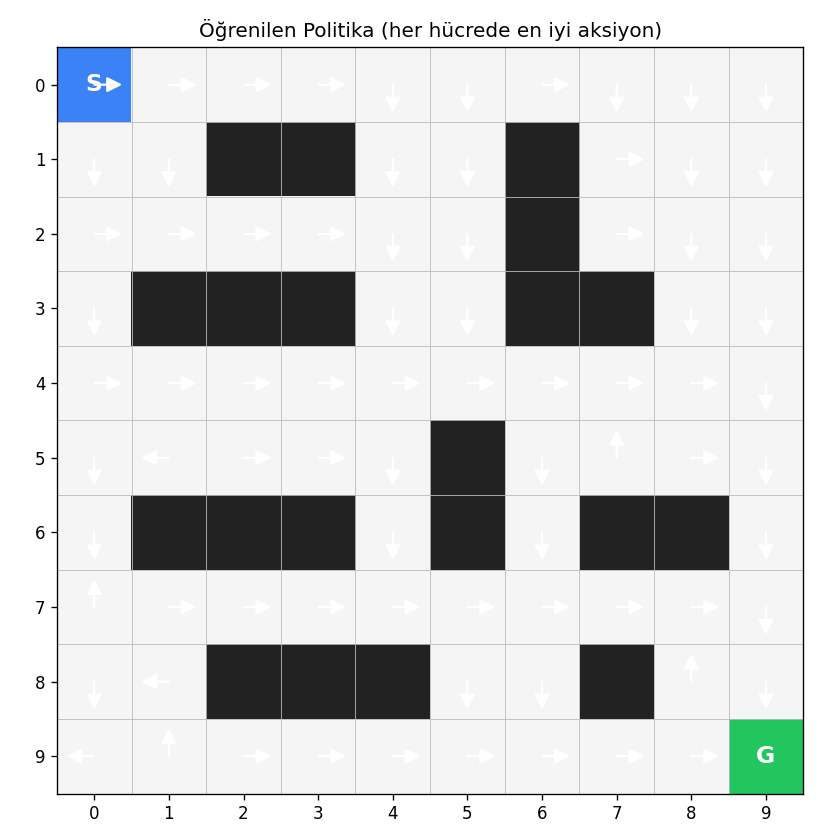

---

## 4. Hiperparametre Karşılaştırması

Ödevin amacının sadece "çalışan bir Q-Learning" değil, parametrelerin etkisini de görmek olduğunu düşündüğüm için varsayılan koşumun yanında üç ayrı karşılaştırma çalıştırdım. Hepsi `experiments.py` dosyasında, aynı tohum (seed=42) ve 1500 episode ile koşturuldu.

**Son 200 episode özeti:**

| Konfigürasyon | Başarı | Ortalama Ödül |
|---|---|---|
| α=0.01 | 72.5% | +23.5 |
| **α=0.10 (varsayılan)** | **92.0%** | **+70.7** |
| α=0.50 | 85.5% | +61.6 |
| γ=0.50 | 83.5% | +59.1 |
| **γ=0.95 (varsayılan)** | **92.0%** | **+70.7** |
| γ=0.99 | 88.5% | +65.8 |
| max_steps=50 | 90.0% | +67.9 |
| **max_steps=200 (varsayılan)** | **92.0%** | **+70.7** |
| max_steps=500 | 92.0% | +70.7 |

### 4.1 Öğrenme Oranı (α)

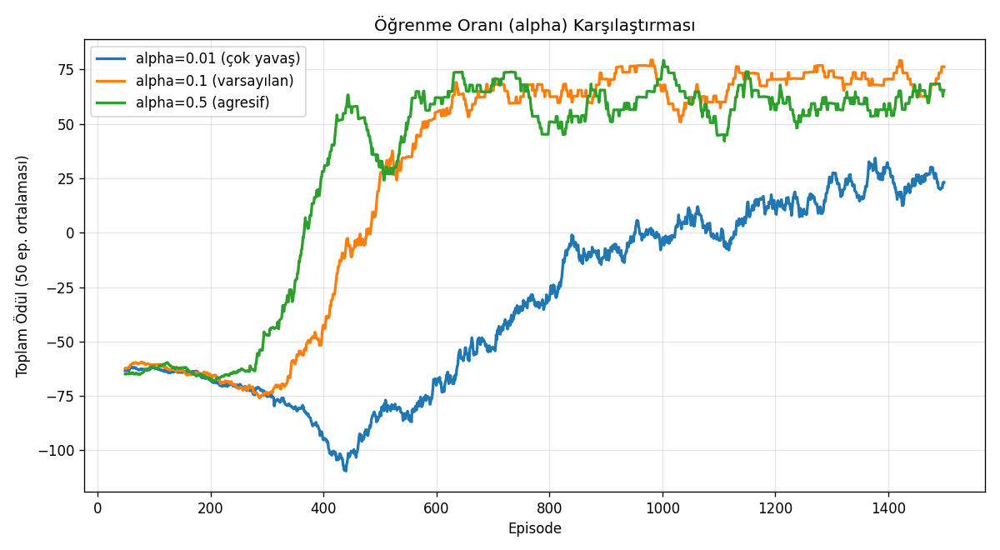

- **α=0.01** çok yavaş öğreniyor — 1500 episode sonunda hâlâ tam yakınsamamış. Her güncelleme yeni deneyimden çok az alıyor.
- **α=0.10** klasik dengeyi sağlıyor: ~500. episode'da yakınsıyor, en yüksek platoya oturuyor.
- **α=0.50** hızlı yakınsıyor (~400. episode) ama eğri daha gürültülü ve sonunda α=0.1'in altında kalıyor. Her güncelleme tahmini fazla "sallıyor", optimum etrafında dolaşıyor.

Ders kitabındaki "büyük α = hızlı ama kararsız, küçük α = yavaş ama temiz" kuralı burada gözle görülür şekilde gerçekleşiyor.

### 4.2 İskonto Faktörü (γ)

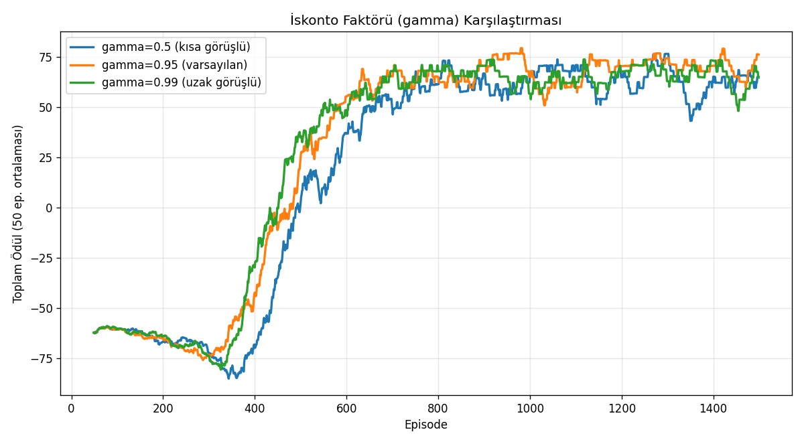

- **γ=0.5** ile ajan uzaktaki +100 ödülünü yeterince değerli görmüyor. Bellman'da γ=0.5 demek 18 adım ötedeki ödülün bugünkü değeri 100 × 0.5^18 ≈ 0.0004 — pratik olarak sıfır. Ajan yakındaki "boş adım −1" cezalarına aşırı odaklanıyor.
- **γ=0.95** sweet spot.
- **γ=0.99** çalışıyor ama 0.95'ten biraz daha gürültülü; uzak ödülleri "fazla" değerli görmek de değer yayılımını yavaşlatıp dalgalandırıyor.

### 4.3 Episode Maksimum Adım Sınırı

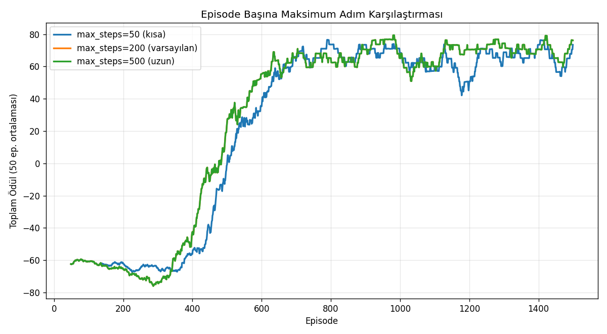

- **max_steps=50** bile yetiyor çünkü Manhattan-optimal yol 18 adım. Yani 50 adım, ajanın iyi bir politika öğrenmesi için yeterli "deney süresi" veriyor.
- **200 ve 500** aynı sonucu veriyor — fazladan adım marjı bu problemde işe yaramıyor.
- 50 ile 200 arasında sezilebilir bir fark olmaması, problemin sınırlama altında olmadığını gösteriyor.

---

## 5. Kod Yapısı

```
QLearning_AGV/
├── environment.py    # GridWorld ortamı (state, action, reward, step)
├── agent.py          # QAgent: Q tablosu, ε-greedy, Bellman güncellemesi
├── train.py          # Eğitim döngüsü ve greedy oynatma
├── visualize.py      # Grafikler ve GIF üretimi
├── experiments.py    # Hiperparametre karşılaştırmaları
├── main.py           # Tek koşum (varsayılan parametrelerle)
├── requirements.txt
├── q_table.npy       # Eğitilmiş Q tablosu (eğitim sonrası oluşur)
└── assets/           # Grafikler ve GIF (eğitim sonrası oluşur)
```

---

## 6. Çalıştırma

```bash
pip install -r requirements.txt

# Varsayılan eğitim + tüm grafikler + GIF
python main.py

# Hiperparametre karşılaştırma deneyleri
python experiments.py
```

`main.py` ortalama 30-60 saniye, `experiments.py` 9 ayrı eğitim koşturduğu için 3-5 dakika sürüyor (CPU).

---

## 7. Üzerinde Düşündüğüm Şeyler / Notlar

- **Engel cezası episode'u bitiriyor.** Başlarda engelle çarpışmayı sadece negatif ödülle modelleyip episode'u devam ettirmeyi düşündüm, ama "kazada robot bozulur" mantığı daha gerçekçi geldi ve öğrenmeyi de hızlandırdı.
- **ε min = 0.05.** Sıfıra indirseydim ajan hiç keşif yapmazdı, ama bu küçük bir oran bırakmak öğrenilen politikadan kayma olduğunda hâlâ alternatif denemesini sağlıyor. Bu yüzden eğitim sonu başarı oranı %100 değil, %90 civarı — çünkü greedy değil eğitim modunda ölçülüyor.
- **Manhattan-optimal yol.** Eğitilmiş ajan greedy modda 18 adımda hedefe gidiyor. Engellerden dolayı bazı haritalarda bu sayı daha yüksek olabilirdi; bu haritada engeller yolun yanlarından dolaşılarak Manhattan-optimal kalmayı mümkün kılıyor.
- **Tekrarlanabilirlik.** Hem ortam hem ajan sabit tohum (seed=42) ile başlatılıyor; tekrar çalıştırınca aynı sonuçlar çıkıyor.

---

## 8. Kaynaklar

Çalışma sırasında ders notlarına ek olarak Sutton & Barto'nun *Reinforcement Learning: An Introduction* kitabının 6. bölümünü (Temporal-Difference Learning) referans aldım. Q-Learning'in yakınsama davranışı ve ε-greedy seçim mantığı için en temel kaynak.
